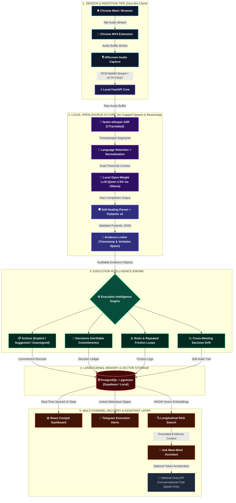
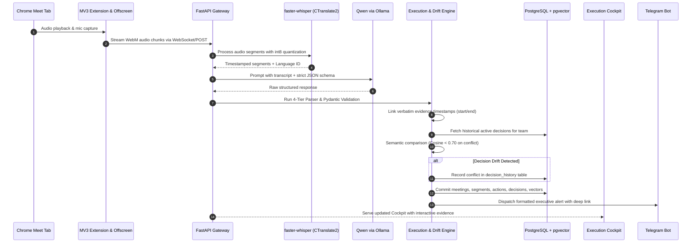
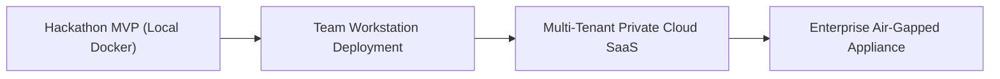

<div align="center">

# Meet-Mind: Private Multilingual Meeting-to-Execution OS

### Beyond Summarization: Turning Conversations into Verifiable Decisions, Accountable Actions, and Longitudinal Organizational Memory

[](#)
[](#)
[](#)
[](#)
[](#)

```
        TODAY'S MEETING ASSISTANT
  Conversation  ───►  Transcript  ───►  Passive Summary

                         ▲
                         │  THE EXECUTION GAP
                         ▼

                 MEET-MIND OS
  Conversation  ───►  Auditable Evidence  ───►  Decisions & Commitments
        │
        ├───►  Longitudinal Memory  ───►  Decision Drift Detection
        │
        └───►  Deterministic Enforcement  ───►  Closed-Loop Execution
```

> **"Meet-Mind does not stop at 'What happened?' It answers: 'What was decided, who committed to what, what exact evidence supports it, and what changed afterward?'"**

</div>

---

## 1. Project Name

**Meet-Mind — Private Multilingual Meeting-to-Execution OS**  
_Target Track:_ **Hacktober Fest — Problem Statement 1 (PS1: Best Open-Source AI Project)**  
_Team:_ **Sankalp** (Kamal Hariramani, Keshva Kathane, Krish Mishra, Vanshaj Dudhe)

---

## 2. Problem Statement

Modern knowledge organizations and high-velocity teams lose hundreds of hours and critical deliverables in the void between **what was said in a meeting** and **what actually gets executed afterward**.

Existing meeting assistants (Otter.ai, Fireflies.ai, Zoom AI Companion) function essentially as passive note-takers. They generate pages of generic summaries that team members rarely read and suffer from five critical failure modes:

1. **The Post-Meeting Execution Void & Follow-up Collapse:**  
   Commitments discussed in calls lose clear ownership or documented deadlines. Because existing tools do not distinguish casual discussion from binding commitments, tasks get lost, deadlines lapse silently, and the same problems are debated repeatedly across meetings.
2. **The AI Hallucination & Evidence Deficit:**  
   Generic LLM summarizers frequently hallucinate task owners and invent arbitrary deadlines to fulfill unstructured prompts. When a tool states _"Rahul will deploy the API tomorrow,"_ there is no direct, verifiable citation linking back to the audio transcript. Without an audit trail, teams cannot trust AI-extracted commitments.
3. **Silent "Decision Drift" Across Meetings:**  
   In fast-moving projects, decisions made in Meeting 1 (e.g., _"We are using PostgreSQL"_) are frequently contradicted in Meeting 3 (e.g., _"Let's switch to MongoDB"_) without reconciling dependent tasks or notifying impacted owners. No existing meeting assistant maintains a cross-meeting longitudinal memory graph to flag when an active decision has been reversed.
4. **Multilingual & Code-Switching Blindspots (Indian Dialects):**  
   Modern engineering and business teams in India naturally converse in mixed dialects—code-switching seamlessly between English, Hindi, and Marathi (_"Rahul, dashboard Friday tak live hona chahiye, warna client demo delay ho jayega"_). Standard English-centric speech and LLM models misinterpret these statements, garble names, and drop crucial action items.
5. **The Privacy Breach of Intrusive Meeting Bots:**  
   Most commercial solutions require inviting a third-party bot (e.g., `Otter.ai Bot`) into the conference call. This violates enterprise data security policies, sends raw, confidential executive audio to external cloud vendors, and makes participants self-conscious or unwilling to discuss proprietary strategies.

---

## 3. Project Overview

**Meet-Mind is an open-source, private-by-design Meeting-to-Execution Operating System.** Rather than generating generic prose summaries, Meet-Mind utilizes an end-to-end open-source AI reasoning pipeline paired with a deterministic execution engine. It captures audio directly from browser tabs with zero bot presence, normalizes multilingual Indian conversations, extracts auditable commitments, and tracks those commitments longitudinally across meeting histories.

### Core Architecture Philosophy: The 5-Layer Stack

```
┌────────────────────────────────────────────────────────────────────────┐
│  Layer 1: CAPTURE       │ Native Chrome MV3 Tab Audio (Zero-Bot)       │
├─────────────────────────┼──────────────────────────────────────────────┤
│  Layer 2: UNDERSTAND    │ Local faster-whisper ASR + Normalization     │
├─────────────────────────┼──────────────────────────────────────────────┤
│  Layer 3: STRUCTURE     │ Local Open-Weight Qwen LLM + 4-Tier Parser   │
├─────────────────────────┼──────────────────────────────────────────────┤
│  Layer 4: VERIFY        │ Action Integrity Engine + Evidence Linking   │
├─────────────────────────┼──────────────────────────────────────────────┤
│  Layer 5: EXECUTE       │ Decision Drift Detector + Cockpit + Telegram │
└────────────────────────────────────────────────────────────────────────┘
```

### Signature Innovations & Core Differentiators

#### 🌟 Hero Feature 1: Action Integrity & The "Evidence-First" AI Contract

Meet-Mind enforces a strict anti-hallucination rule: **No transcript evidence → no high-confidence claim.** If the transcript does not unambiguously support an owner or a deadline, Meet-Mind explicitly classifies the task as unassigned rather than guessing.

```
┌─────────────────────────────────┐   ┌───────────────────────────────────────────┐
│     TYPICAL MEETING ASSISTANT   │   │                MEET-MIND OS               │
├─────────────────────────────────┤   ├───────────────────────────────────────────┤
│ "Issue discussed.               │   │ ACTION:      Deploy backend API           │
│  Rahul should probably fix it." │   │ OWNER:       Rahul                        │
│                                 │   │ DEADLINE:    Friday (2026-10-10)          │
│ • Owner: Assumed                │   │ COMMITMENT:  Explicit Commitment (High)   │
│ • Evidence: None                │   │ CONFIDENCE:  0.94                         │
│ • Verifiable: No                │   │ EVIDENCE:    00:42:17 ──► 00:42:29        │
│                                 │   │ SOURCE TEXT: "Rahul: Mai Friday tak       │
│                                 │   │              deployment complete kar      │
│                                 │   │              dunga."                      │
└─────────────────────────────────┘   └───────────────────────────────────────────┘
```

The system classifies every detected task into one of three auditable commitment states:

- **Explicit Commitment:** A specific speaker explicitly takes personal ownership (_"I will finish the auth service by Thursday"_).
- **Suggested Action:** Consensus is reached on work that must be done, but no single driver has taken ownership (_"We should benchmark Redis this sprint"_).
- **Unassigned Task:** Identified work with `owner: null` and `status: "unassigned"`, immediately flagging organizational ambiguity.

#### 🌟 Hero Feature 2: Cross-Meeting Decision Drift Detection

Meet-Mind builds an organizational memory graph in `PostgreSQL + pgvector`. When a new meeting records a decision, the **Decision Drift Engine** semantically compares it against prior active decisions for the team.

```
  MEETING 1 (Sprint Planning - Oct 1)
  Decision: "Use PostgreSQL with pgvector for storage." ──► Stored as Active Decision
                                │
                                ▼  [Time Lapse: 4 Days]
  MEETING 3 (Architecture Review - Oct 5)
  Decision: "Let's migrate primary storage to MongoDB."
                                │
                                ▼
  ┌─────────────────────────────────────────────────────────────────────────────┐
  │ ⚠ MEET-MIND DECISION DRIFT ALERT DETECTED                                   │
  │ • Previous Decision: Use PostgreSQL (Oct 1, 00:14:20)                       │
  │ • New Decision:      Switch to MongoDB (Oct 5, 00:32:10)                     │
  │ • Impact Analysis:   2 dependent action items affected ("Setup PG schemas") │
  │ • Action Required:   Review dependent tasks and confirm architectural shift │
  └─────────────────────────────────────────────────────────────────────────────┘
```

#### 🌟 Hero Feature 3: Repeated-Discussion Friction Detector

If an agenda item or topic is debated across $\ge 2$ successive meetings without an explicit decision recorded, Meet-Mind categorizes it as an **Active Organizational Blocker**, exposing chronic execution bottlenecks to team leads.

---

## 4. Proposed Solution

Meet-Mind is engineered as a local-first, zero-bot execution engine consisting of:

1. **Zero-Bot Browser Tab Audio Ingestion:**  
   A Chrome Manifest V3 extension utilizes `chrome.tabCapture` and an offscreen audio document to stream raw meeting audio directly from Google Meet or web conferences to a local FastAPI backend. No external bots join the call; no participants feel surveilled.
2. **Local Multilingual Speech-to-Text Pipeline:**  
   Powered by `faster-whisper` (CTranslate2 inference engine), transcribing audio on local hardware. The pipeline performs segment-level language identification and dual-transcript storage: preserving native script (Hindi, Marathi, Hinglish) alongside normalized English semantics.
3. **Open-Weight Reasoning LLM & 4-Tier Self-Healing JSON Parser:**  
   A locally hosted open-weight Small Language Model (`Qwen 2.5 / Qwen 3` via `Ollama`) structures unstructured conversation into rigid JSON schemas. A resilient 4-tier parser ensures pipeline zero-crash reliability:
   $$\text{Direct JSON loads} \longrightarrow \text{Markdown Fence Extractor} \longrightarrow \text{Brace Auto-Repair} \longrightarrow \text{Safe Default Schema}$$
4. **Unified Relational & Dense Vector Engine (`PostgreSQL + pgvector`):**  
   Metadata, transcript segments, decision histories, and BGE vector embeddings reside in a single database, eliminating distributed state desynchronization and powering fast, role-scoped historical RAG queries.
5. **Multi-Channel Closed-Loop Automation:**  
   Instant executive action digests dispatched via Telegram Bot API with deep links back to an interactive **React Execution Cockpit** where every extracted item links directly to its source audio timestamp.

### Why Not Existing Solutions? (Category Differentiation)

| Capability / Metric                 | Typical AI Assistant (Otter, Fireflies) | Enterprise Suite (Teams Copilot) | Meet-Mind OS                                                   |
| ----------------------------------- | --------------------------------------- | -------------------------------- | -------------------------------------------------------------- |
| **Core Category**                   | AI Note-Taker / Summarizer              | Proprietary Platform Add-on      | **Meeting-to-Execution OS**                                    |
| **Meeting Bot Required?**           | Yes (joins call as guest)               | Yes (tied to MS ecosystem)       | **No (native MV3 tab capture)**                                |
| **Audio Privacy & Storage**         | Transmitted to third-party cloud        | Stored in corporate cloud        | **Local-by-default; Zero audio leaves machine**                |
| **Open-Source AI Foundation**       | Proprietary closed API                  | Proprietary Azure OpenAI         | **100% Open-Source / Open-Weight (faster-whisper, Qwen, BGE)** |
| **Indian Dialect Code-Switching**   | Poor / High Word Error Rate             | Moderate                         | **Native focus: English, Hindi, Marathi, Hinglish**            |
| **Action Extraction Integrity**     | Heuristic text generation               | Basic task bullets               | **Evidence-linked with 3 commitment states**                   |
| **Anti-Hallucination Owner Policy** | Guesses or drops owner                  | Assigns from user directory      | **Strict rule: null if unsupported by evidence**               |
| **Cross-Meeting Decision Drift**    | None                                    | None                             | **Core capability via pgvector semantic comparison**           |
| **Repeated-Discussion Friction**    | None                                    | None                             | **Automated detection across meetings ($\ge 2$ syncs)**        |
| **Verifiable Transcript Citations** | Rough paragraph text                    | Rough transcript link            | **Exact start/end timestamp cues + verbatim source**           |

---

## 5. Objectives

- **Target Track Alignment:** Strictly fulfill **PS1: Best Open-Source AI Project** by putting open-source AI at the indispensable center of the architecture, rejecting superficial API wrappers.
- **Auditable Accountability:** Eliminate post-meeting task loss by generating structured action items with verbatim evidence spans and confidence scores.
- **Zero-Bot Privacy Assurance:** Keep 100% of raw meeting audio on local infrastructure during processing, ensuring zero external surveillance.
- **Longitudinal Organizational Memory:** Retain institutional context across meetings to identify decision reversals and recurring unresolved discussions.
- **Multilingual Linguistic Robustness:** Provide high transcription accuracy and semantic comprehension across Indian code-switched dialogues (Hinglish/Marathi).
- **Production Feasibility:** Deliver a clean, fully functional, containerized system ready for evaluation and live demonstration in the final hackathon.

---

## 6. Target Users / Use Case

```
┌────────────────────────────────────────────────────────────────────────┐
│                        TARGET USER PERSONAS                            │
├────────────────────┬───────────────────────────────────────────────────┤
│ High-Velocity      │ Fast sprint pivots, architectural shifts, and     │
│ Startups           │ cross-functional commitments where decisions drift│
├────────────────────┼───────────────────────────────────────────────────┤
│ Engineering &      │ Daily standups, tech spec debates (e.g. database  │
│ Tech Teams         │ selection, API contracts) needing verifiable logs │
├────────────────────┼───────────────────────────────────────────────────┤
│ Student & College  │ Hackathons, capstone projects, and student clubs  │
│ Project Groups     │ prone to unclear ownership and missing deadlines  │
├────────────────────┼───────────────────────────────────────────────────┤
│ Product Agencies & │ Documenting explicit client commitments vs scope  │
│ Consultancies      │ creep with incontrovertible timestamped evidence │
├────────────────────┼───────────────────────────────────────────────────┤
│ Privacy-Sensitive  │ Legal, research, NGO, and healthcare teams unable │
│ Organizations      │ to use cloud-hosted bots due to confidentiality   │
└────────────────────────────────────────────────────────────────────────┘
```

### End-to-End Persona Scenario: Engineering Sprint Sync

1. **The Context:** An engineering team holds an architecture sync on Google Meet. Members speak in mixed English and Hindi.
2. **The Discussion:** Rahul states: _"Mai auth module Friday tak finish kar dunga."_ Neha proposes: _"We should evaluate Stripe vs Razorpay, but no final call today."_ The lead says: _"Last week we decided on MongoDB, but today we agree PostgreSQL is better for vector search."_
3. **Meet-Mind Processing:**
   - Tab audio is recorded natively without a bot.
   - `faster-whisper` transcribes and preserves Hinglish audio.
   - `Qwen` extracts:
     - Task 1: _"Finish auth module"_, Owner: `Rahul`, Deadline: `Friday`, Status: `Explicit Commitment`, Evidence: `00:12:15 - 00:12:28`.
     - Task 2: _"Evaluate Stripe vs Razorpay"_, Owner: `null`, Status: `Unassigned Task`.
     - Decision: _"Use PostgreSQL for vector search"_.
   - **Decision Drift Alert Triggered:** `PostgreSQL` contradicts the previous meeting's decision to use `MongoDB`.
4. **The Resolution:** A concise execution alert reaches the team Telegram group within seconds. The lead clicks the link, views the Cockpit dashboard, clicks the drift alert, and hears the exact 13-second audio snippet where the commitment was made.

---

## 7. Open-Source AI Technology Selected

Meet-Mind relies strictly on vetted open-source and open-weight AI technologies:

| AI Component                     | Specific Technology                                 | License                  | Exact Role in Meet-Mind                                                                              |
| -------------------------------- | --------------------------------------------------- | ------------------------ | ---------------------------------------------------------------------------------------------------- |
| **Speech-to-Text (ASR)**         | `faster-whisper` (CTranslate2 engine)               | MIT                      | Real-time & batch local multilingual audio transcription with timestamp generation.                  |
| **Reasoning & Intelligence LLM** | `Qwen 2.5 (7B-Instruct) / Qwen 3 (8B)` via `Ollama` | Apache 2.0 / Open-Weight | Semantic reasoning, commitment classification, structured JSON extraction, and Hinglish translation. |
| **Embedding Model**              | `BAAI/bge-small-en-v1.5` (or `bge-m3`)              | MIT                      | 384-dimensional dense semantic vector representations for transcript chunks and decisions.           |
| **Vector Search Engine**         | `pgvector` (PostgreSQL extension)                   | PostgreSQL Open License  | High-speed HNSW indexing for hybrid RAG search over historical meeting intelligence.                 |
| **Structured Validation**        | `Pydantic v2` + Self-Healing Parser                 | MIT                      | Deterministic schema enforcement preventing LLM hallucinations and malformed outputs.                |
| **Secondary Chat Acceleration**  | `Groq API` (_Strictly Optional / Opt-in_)           | Commercial Client        | Optional secondary acceleration for conversational Q&A speed in user assistant chat.                 |

---

## 8. Why This Technology Was Selected

The selection of each open-source AI component is driven directly by core engineering requirements rather than popularity:

```
                          OPEN-SOURCE AI DEPENDENCY CHAIN

             Meeting Audio (Browser Tab Stream)
                            │
                            ▼
             faster-whisper (CTranslate2)
             [Why: 4x faster than vanilla Whisper, int8 quantization, local GPU/CPU]
                            │
                            ▼
             Language Identification & Normalization
             [Why: Preserves vernacular Hindi/Marathi script + normalized English]
                            │
                            ▼
             Qwen 2.5 / Qwen 3 via Ollama
             [Why: Top-tier multilingual benchmarks, zero data egress, strict JSON]
                            │
                            ▼
             BGE-Small-EN-v1.5 / BGE-M3 Embeddings
             [Why: State-of-the-art MTEB retrieval performance, lightweight 384-dim]
                            │
                            ▼
             PostgreSQL + pgvector (HNSW Index)
             [Why: Unifies relational metadata and vector embeddings in one DB]
```

### Deep Technical Justifications

1. **Why `faster-whisper` over Whisper API or cloud speech services?**
   - **Inference Speed:** Uses CTranslate2 (a custom C++ inference engine), achieving up to 4x faster transcription than HuggingFace Whisper implementations with 70% less VRAM.
   - **Air-Gapped Privacy:** Ingests raw PCM audio buffers locally without sending voice recordings to external endpoints.
   - **Timestamp Precision:** Emits exact millisecond-level word and segment timestamps essential for Evidence Linking.

2. **Why `Qwen 2.5 / Qwen 3` over proprietary models or competing SLMs?**
   - **Multilingual & Indic Fluency:** Qwen outperforms comparable-sized open-weight models (Llama-3, Gemma-2) on Asian and Indic code-switched comprehension.
   - **Strict Schema Adherence:** Exhibits high fidelity in following rigid JSON schemas and Pydantic constraints, minimizing hallucinated keys.
   - **Hardware Feasibility:** The 7B/8B 4-bit quantized variant runs smoothly on consumer hardware (8GB-12GB VRAM or Apple Silicon), aligning with hackathon workstation constraints.

3. **Why `PostgreSQL + pgvector` over standalone vector databases (Pinecone, Chroma, Qdrant)?**
   - **Unified Data Model:** Meeting data is inherently relational (organizations, meetings, participants, tasks, deadlines). Running a separate vector DB introduces dual-write hazards and eventual consistency bugs.
   - **ACID & Row-Level Security:** PostgreSQL provides battle-tested transactions, foreign key constraints, and native Supabase Row-Level Security (RLS) policies.
   - **HNSW Indexing:** Native hierarchical navigable small-world (HNSW) graph indexing delivers sub-5ms vector search directly inside SQL queries.

4. **Why is `Groq` strictly an optional secondary layer?**
   - Meet-Mind **never** depends on Groq for meeting intelligence, transcription, or structured extraction. Core extraction runs 100% locally. Groq is optionally hooked into the _Ask Meet-Mind_ assistant solely to deliver ultra-fast token streaming during live Q&A demos without compromising PS1 compliance.

---

## 9. AI's Role in the System

A core architectural strength of Meet-Mind is the strict separation between **probabilistic AI reasoning** and **deterministic system execution**:

```
┌───────────────────────────────────────┐     ┌────────────────────────────────────────┐
│     AI REASONING PIPELINE (Local)     │     │    DETERMINISTIC ENGINE (Backend)      │
├───────────────────────────────────────┤     ├────────────────────────────────────────┤
│ • Speech-to-text transcription        │     │ • Pydantic schema validation           │
│ • Code-switched language translation  │     │ • 4-tier self-healing JSON parser      │
│ • Topic segmentation & summarization  │ ──► │ • Database transactions & state machine│
│ • Commitment state classification     │     │ • Supabase Row-Level Security (RLS)    │
│ • Evidence segment identification     │     │ • Task deadline tracking & timers      │
│ • Semantic embedding & similarity     │     │ • Telegram / webhook notification dispatch
└───────────────────────────────────────┘     └────────────────────────────────────────┘
```

### The System Safety Contract: AI Recommends, Software Enforces

- **AI is Never Autonomous Over State:** The LLM cannot directly create or modify database records without passing through the Pydantic validator.
- **Confidence is Not Truth:** AI confidence scores indicate probabilistic model certainty. Evidence provides verifiable traceability. If a confidence score falls below 0.70, the item is tagged for human review.
- **Anti-Hallucination Invariant:** If the verbatim transcript does not state a clear individual owner, the schema requires:
  ```json
  {
    "task": "Deploy payment service",
    "owner": null,
    "owner_status": "unassigned",
    "confidence": 0.88,
    "evidence_segment": "seg_042"
  }
  ```
  The deterministic engine preserves the `null` owner and flags the task on the dashboard as needing manual assignment.

---

## 10. System Architecture

Meet-Mind is engineered as an **air-gapped, local-first intelligence pipeline paired with a deterministic execution engine**. The system eliminates the need for intrusive meeting bots by capturing audio directly at the browser layer, executing speech-to-text and reasoning models on local hardware, and maintaining a verifiable execution ledger backed by relational and vector memory.

### Visual Architecture Blueprint

```
┌───────────────────────────────────────────────────────────────────────────────────────────────────────┐
│                                       CLIENT LAYER (ZERO-BOT)                                         │
│   ┌────────────────────────────────┐         ┌────────────────────────────────────────────────────┐   │
│   │   Google Meet / Browser Tab    │ ──────► │ Chrome MV3 Extension (Offscreen MediaRecorder API) │   │
│   └────────────────────────────────┘         └─────────────────────────┬──────────────────────────┘   │
└────────────────────────────────────────────────────────────────────────┼──────────────────────────────┘
                                                                         │ Audio Stream (PCM / WebM)
                                                                         ▼
┌───────────────────────────────────────────────────────────────────────────────────────────────────────┐
│                                    LOCAL INGESTION GATEWAY (FastAPI)                                  │
│   ┌───────────────────────────────────────────────────────────────────────────────────────────────┐   │
│   │              FastAPI Orchestrator (Async Audio Buffer & Session Coordinator)                 │   │
│   └────────────────────────────────────────────┬──────────────────────────────────────────────────┘   │
└────────────────────────────────────────────────┼──────────────────────────────────────────────────────┘
                                                 │ Audio Buffers
                                                 ▼
┌───────────────────────────────────────────────────────────────────────────────────────────────────────┐
│                            LOCAL OPEN-SOURCE AI INTELLIGENCE CORE (OLLAMA / GPU)                      │
│   ┌───────────────────────────────────────────────────────────────────────────────────────────────┐   │
│   │  1. Speech Recognition: faster-whisper (CTranslate2 int8 Inference Engine)                    │   │
│   └────────────────────────────────────────────┬──────────────────────────────────────────────────┘   │
│                                                │ Timestamped Segments
│                                                ▼
│   ┌───────────────────────────────────────────────────────────────────────────────────────────────┐   │
│   │  2. Language Normalization: Indic / Hinglish / Marathi ──► Normalized Semantic English        │   │
│   └────────────────────────────────────────────┬──────────────────────────────────────────────────┘   │
│                                                │ Dual-Transcript Payloads
│                                                ▼
│   ┌───────────────────────────────────────────────────────────────────────────────────────────────┐   │
│   │  3. Reasoning LLM: Local Open-Weight Qwen 2.5 / 3 via Ollama                                  │   │
│   └────────────────────────────────────────────┬──────────────────────────────────────────────────┘   │
│                                                │ Raw Model Completion
│                                                ▼
│   ┌───────────────────────────────────────────────────────────────────────────────────────────────┐   │
│   │  4. Validation: 4-Tier Self-Healing JSON Parser + Strict Pydantic v2 Contracts                │   │
│   └────────────────────────────────────────────┬──────────────────────────────────────────────────┘   │
│                                                │ Validated JSON Schema
│                                                ▼
│   ┌───────────────────────────────────────────────────────────────────────────────────────────────┐   │
│   │  5. Verification: Evidence Linker (Millisecond Timestamp Spans & Verbatim Quotes)             │   │
│   └────────────────────────────────────────────┬──────────────────────────────────────────────────┘   │
└────────────────────────────────────────────────┼──────────────────────────────────────────────────────┘
                                                 │ Auditable Objects
                                                 ▼
┌───────────────────────────────────────────────────────────────────────────────────────────────────────┐
│                                   EXECUTION INTELLIGENCE ENGINE                                       │
│          ┌──────────────────┬──────────────────┬──────────────────┬──────────────────┐                │
│          │     ACTIONS      │    DECISIONS     │      RISKS       │  DECISION DRIFT  │                │
│          │  (3-State Trust) │ (Binding Ledger) │ (Friction Loops) │ (Cross-Meeting)  │                │
│          └─────────┬────────┴─────────┬────────┴─────────┬────────┴─────────┬────────┘                │
└────────────────────┼──────────────────┼──────────────────┼──────────────────┼─────────────────────────┘
                     └──────────────────┴─────────┬────────┴──────────────────┘
                                                  │ Normalized Records + Embeddings
                                                  ▼
┌───────────────────────────────────────────────────────────────────────────────────────────────────────┐
│                                UNIFIED RELATIONAL & VECTOR STORAGE                                    │
│   ┌───────────────────────────────────────────────────────────────────────────────────────────────┐   │
│   │         PostgreSQL + pgvector (Supabase / Local) [HNSW Indexed, Row-Level Security]           │   │
│   └───────────────────────────────┬───────────────────────────────┬───────────────────────────────┘   │
└───────────────────────────────────┼───────────────────────────────┼───────────────────────────────────┘
                                    │                               │
                 ┌──────────────────┴───────────────┐               │ Dense Vector Retrieval
                 │                                  │               ▼
                 ▼                                  ▼      ┌────────────────────────────────────────┐
┌─────────────────────────────────┐ ┌────────────────────┐ │ Longitudinal Meeting RAG Search        │
│ React Execution Cockpit (UI)    │ │ Telegram Bot API   │ └───────────────────┬────────────────────┘
│ • Real-time MoM & KPI Cards     │ │ • Instant Digest   │                     │ Grounded Context
│ • Click-to-Cue Audio Evidence   │ │ • Action Reminders │                     ▼
│ • Visual Decision Drift Graph   │ │ • Deep Link Cues   │ ┌────────────────────────────────────────┐
└─────────────────────────────────┘ └────────────────────┘ │ Ask Meet-Mind Conversational Assistant │
                                                           └───────────────────┬────────────────────┘
                                                                               │ Optional Streaming
                                                                               ▼
                                                           ┌────────────────────────────────────────┐
                                                           │ Optional Groq API (Chat Acceleration)  │
                                                           └────────────────────────────────────────┘
```

### Complete End-to-End System Flowchart

The styled flowchart below maps every operational node and interface boundary across the five tiers of Meet-Mind:



### Architectural Layer Matrix

| Layer            | Component                            | Protocol / Interface              | Input                              | Output                               | Security / Privacy Boundary                          |
| ---------------- | ------------------------------------ | --------------------------------- | ---------------------------------- | ------------------------------------ | ---------------------------------------------------- |
| **Capture**      | Chrome MV3 Extension + Offscreen Doc | Chrome Extensions API / Web Audio | Browser Tab Audio Stream           | 256kbps WebM/PCM Audio Blobs         | **Local Client Sandbox** (Zero external bot invite)  |
| **Ingestion**    | FastAPI Backend Gateway              | HTTP `multipart/form-data` & WS   | Audio Blobs / Chunks               | Temp In-Memory Audio Buffers         | **Localhost Only** (`127.0.0.1:8000`)                |
| **ASR**          | faster-whisper (CTranslate2)         | Python C-Bindings / Local CUDA    | Raw Audio Buffers                  | Timestamped Text Segments + Lang ID  | **Local Machine Compute** (No audio sent to cloud)   |
| **Reasoning**    | Qwen 2.5 / 3 via Ollama              | Local REST API (`11434`)          | Normalized Transcript + Prompts    | Structured JSON Strings              | **Local Machine Compute** (Air-gapped LLM)           |
| **Integrity**    | Parser + Evidence Linker             | Pure Python / Pydantic v2         | Unchecked JSON Strings             | Auditable Entities with Evidence IDs | **Deterministic Validation** (Zero hallucinations)   |
| **Execution**    | Decision Drift & Risk Engine         | Python Async Workers              | New Decisions & Action Graph       | Drift Alerts & Blocker Metrics       | **Deterministic Logic** (Cross-meeting diffs)        |
| **Storage**      | PostgreSQL 15 + pgvector             | SQL (asyncpg) / Supabase Client   | Relational Entities + 384d Vectors | HNSW Vector Indexes & Query Hits     | **Database Encrypted at Rest & Row-Level Security**  |
| **Delivery**     | React Cockpit + Telegram Bot         | React SPA & Telegram Bot API      | REST API / Webhooks                | Interactive UI Cues & Push Alerts    | **Granular Role-Based Access Control**               |
| **Acceleration** | Groq API (_Strictly Opt-In_)         | HTTPS REST Client                 | Anonymized Question Context        | Fast Conversational Tokens           | **Optional Chat Acceleration Only** (Opt-in by user) |

---

## 11. Component-Level Architecture

Meet-Mind is structured into six modular, loosely coupled subsystems:

### Pillar 1: Client Sensor (Chrome Manifest V3 Extension)

- **Offscreen Audio Capture:** Utilizes `chrome.tabCapture.capture()` coupled with an MV3 `offscreen.html` document running `MediaRecorder` to bypass background service worker timeout limitations.
- **Zero-Bot Tab Capture:** Intercepts outgoing and incoming tab audio streams natively without joining the call as an intrusive guest account.
- **Live Bilingual Caption Overlay:** Renders lightweight, non-obtrusive floating badges on top of Google Meet showing live translated text (`[HI → EN]`).

### Pillar 2: Core Orchestration Gateway (FastAPI Backend)

- **FastAPI Service:** Provides asynchronous REST endpoints and WebSocket handlers for streaming audio ingestion, meeting finalization, and RAG queries.
- **Pydantic v2 Contracts:** Strict typing and validation for meeting metadata, decisions, action items, evidence spans, and user queries.

### Pillar 3: Speech & Multilingual Processing Engine

- **faster-whisper Engine:** Runs CTranslate2 with int8 quantization on local GPU/CPU.
- **Dual-Transcript Model:** Preserves raw verbatim speech in native script (Devanagari/Latin) while generating a normalized semantic English transcript to guarantee accurate downstream LLM reasoning.

### Pillar 4: Intelligence & Action Integrity Core

- **Ollama Model Runtime:** Manages local instance execution of `qwen2.5:7b-instruct` or `qwen3:8b`.
- **4-Tier Self-Healing Parser (`json_parser.py`):**
  1. _Tier 1:_ Direct `json.loads()` on LLM response.
  2. _Tier 2:_ Regex extraction isolating content within markdown ` ```json ... ``` ` fences.
  3. _Tier 3:_ First-to-last brace substring matching with auto-quote and auto-comma patching.
  4. _Tier 4:_ Safe fallback populator injecting empty arrays into required schema fields to prevent pipeline crashes.
- **Evidence Linker:** Maps each extracted action or decision to exact transcript segment IDs (`start_time`, `end_time`, `speaker`, `verbatim_quote`).

### Pillar 5: Longitudinal Memory & Vector Store (`PostgreSQL + pgvector`)

- **Relational Schema:** Normalized tables for `organizations`, `users`, `meetings`, `transcript_segments`, `decisions`, `action_items`, `risks`, `decision_history`, and `notifications`.
- **Dense Vector Indexing:** Employs HNSW indexing over 384-dimensional BGE embeddings to perform cosine similarity queries in sub-5ms latency.
- **Row-Level Security (RLS):** SQL-level tenant isolation ensuring users can only query meetings and decisions within their authorized organization.

```sql
-- Relational Schema Excerpt
CREATE TABLE decisions (
    id UUID PRIMARY KEY DEFAULT gen_random_uuid(),
    meeting_id UUID REFERENCES meetings(id) ON DELETE CASCADE,
    decision_text TEXT NOT NULL,
    confidence FLOAT NOT NULL,
    status TEXT DEFAULT 'active', -- active, superseded, revoked
    evidence_start TEXT NOT NULL,
    evidence_end TEXT NOT NULL,
    created_at TIMESTAMPTZ DEFAULT NOW()
);

CREATE TABLE decision_history (
    id UUID PRIMARY KEY DEFAULT gen_random_uuid(),
    decision_id UUID REFERENCES decisions(id),
    previous_value TEXT NOT NULL,
    new_value TEXT NOT NULL,
    meeting_id UUID REFERENCES meetings(id),
    changed_at TIMESTAMPTZ DEFAULT NOW()
);
```

### Pillar 6: Multi-Channel Delivery & Cockpit UI

- **React Cockpit (Vite + Tailwind CSS + shadcn/ui):** Executive dashboard featuring KPI summary cards (Active Decisions, Overdue Actions, Decision Drift Alerts), split-pane meeting inspector, and interactive transcript segment cues.
- **Telegram Bot API:** Lightweight, accessible notification channel dispatching instant post-meeting executive digests and overdue task reminders with deep links back to the Cockpit.

---

## 12. Data / Information Flow

The end-to-end data flow represents an engineered system, not a simple `Audio → Cloud API → Text` call:



### Detailed Engineering Steps

1. **Native Tab Audio Ingestion:**  
   The Chrome extension captures browser audio using `chrome.tabCapture.capture({ audio: true })`. An offscreen document encapsulates a `MediaRecorder` instance producing 256kbps audio chunks transmitted via HTTP `multipart/form-data` or WebSocket streams to `http://localhost:8000/api/v1/meetings/process-audio`.
2. **Local ASR & Language Identification:**  
   The audio stream is buffered into memory and processed by `faster-whisper`. The model extracts language probability scores. If Hindi/Marathi code-switching is detected, the segments undergo bilingual normalization.
3. **Structured Intelligence Extraction:**  
   The normalized transcript is injected into an extraction prompt enforcing strict Pydantic schemas. The local `Qwen` model isolates:
   - Key discussion themes.
   - Binding decisions.
   - Action items classified by commitment level.
   - Explicit deadlines (ISO-formatted date or relative temporal anchors).
   - Verifiable source evidence spans.
4. **Self-Healing Parsing & Validation:**  
   The response passes through the 4-tier parser. Any missing brackets or markdown decorations are repaired programmatically. Pydantic validates data types, bounding confidence between $0.0$ and $1.0$.
5. **Evidence Linking:**  
   The Evidence Linker cross-references extracted snippets against segment start and end timestamps, stamping exact time boundaries onto each action item.
6. **Cross-Meeting Drift Analysis:**  
   Prior active decisions are retrieved from PostgreSQL. If a new decision modifies or contradicts a previous decision (determined via embedding distance and semantic polarity checks), a `DECISION_DRIFT_ALERT` is logged in `decision_history`.
7. **Storage & Multi-Channel Alerting:**  
   Relational data and BGE embeddings are committed to PostgreSQL. An asynchronous background task formats an executive digest and dispatches it to the team's Telegram group.

---

## 13. Agentic Workflow (AI Reasoning & Deterministic Execution Pipeline)

Rather than advertising five unconstrained, autonomous agents that could hallucinate state changes, Meet-Mind coordinates **specialized AI reasoning units governed by a deterministic execution pipeline**:

```
┌────────────────────────────────────────────────────────────────────────┐
│               AI REASONING & EXECUTION PIPELINE                        │
└────────────────────────────────────────────────────────────────────────┘

    Raw Multilingual Audio
              │
              ▼
    [1. Multilingual Speech & Normalization Engine]
              │
              ▼
    [2. Meeting Intelligence Extractor]
              │
              ▼
    [3. Action Integrity Classifier]
              │ (Separates: Explicit Commitment | Suggested Action | Unassigned)
              ▼
    [4. Evidence Linking Engine]
              │ (Anchors decisions and tasks to exact audio timestamps)
              ▼
    [5. Decision Drift & Blocker Engine]
              │ (Compares current decisions to organizational memory graph)
              ▼
    [6. Task Risk & Recovery Engine (Deterministic Policy + Human-in-the-Loop)]
              │
              ├──► Detect at-risk or overdue task
              ├──► Check evidence, original owner, and deadline
              ├──► Evaluate policy rules & candidate availability
              ├──► Recommend recovery action
              └──► Require HUMAN APPROVAL via Cockpit before state change
              │
              ▼
    [7. Communication Dispatcher]
              │ (Pushes executive digests to Telegram with evidence deep links)
```

### The Task Risk & Recovery Policy

In contrast to risky systems that autonomously reassign work without permissions or context, Meet-Mind implements a defensible **Human-in-the-Loop policy**:

1. When a task approaches its deadline or is flagged as at-risk, the engine inspects the evidence record.
2. The engine scores potential reassignments based on explicit meeting participant context.
3. A notification is dispatched: _"Task 'Deploy API' is at risk. Suggested action: Reassign to Neha (Context: Neha assisted on API specs in Meeting 2). [Approve] [Dismiss]"_.
4. **Autonomous reassignment is strictly a future, policy-controlled enterprise option requiring explicit administrative activation.**

---

## 14. Technology Stack

```
┌─────────────────┬───────────────────────────────┬────────────────────────────┐
│ Layer           │ Technology                    │ Version / Framework        │
├─────────────────┼───────────────────────────────┼────────────────────────────┤
│ Client Sensor   │ Chrome Manifest V3 Extension  │ JavaScript / Web APIs      │
│ Frontend UI     │ React + Vite + Tailwind CSS   │ React 18, shadcn/ui        │
│ Backend API     │ FastAPI (Python 3.10+)        │ Uvicorn, Pydantic v2       │
│ Speech AI       │ faster-whisper                │ CTranslate2 (int8/float16) │
│ Reasoning AI    │ Qwen 2.5 (7B) / Qwen 3 (8B)   │ Ollama Local Runner        │
│ Embeddings      │ BAAI/bge-small-en-v1.5        │ sentence-transformers      │
│ Database/Vector │ PostgreSQL 15+ with pgvector  │ Supabase / Self-hosted     │
│ Messaging       │ Telegram Bot API              │ python-telegram-bot        │
│ Acceleration    │ Groq API (Secondary / Opt-in) │ groq-python client         │
│ DevOps/Deploy   │ Docker & Docker Compose       │ Linux / Windows Containers │
└─────────────────┴───────────────────────────────┴────────────────────────────┘
```

---

## 15. Expected Features

| Feature               | Hackathon MVP Scope                              | Enterprise Production Scope                   |
| --------------------- | ------------------------------------------------ | --------------------------------------------- |
| **Audio Capture**     | Chrome MV3 tab audio capture (Google Meet)       | Multi-platform desktop audio + WebRTC bridge  |
| **Language Support**  | English, Hindi, Marathi, Hinglish code-switching | Extended Pan-Indic & European language models |
| **Commitment States** | 3 States (Explicit, Suggested, Unassigned)       | Dynamic confidence calibration per speaker    |
| **Evidence Linking**  | Exact start/end timestamps + verbatim quote      | Interactive waveform audio snippet playback   |
| **Decision Drift**    | Cross-meeting semantic drift alerts              | Multi-branch organizational decision trees    |
| **Meeting Loops**     | Flags unresolved topics across $\ge 2$ meetings  | Team friction index & agenda debt scoring     |
| **Task Recovery**     | Human-in-the-loop reassignment recommendations   | Configurable autonomous policy workflows      |
| **Notifications**     | Telegram Bot executive alerts & deep links       | Slack, Microsoft Teams, and Webhooks          |
| **Knowledge RAG**     | PostgreSQL + pgvector hybrid search              | Multi-organization hybrid graph + vector RAG  |
| **Data Privacy**      | Local-first audio processing & open LLM          | Air-gapped on-premise container deployment    |

---

## 16. Implementation Approach

The implementation roadmap divides development into five sequential, highly feasible milestones designed for delivery by the final hackathon date:

```
┌─────────────────────────────────────────────────────────────────────────┐
│                    PHASED IMPLEMENTATION ROADMAP                        │
├─────────────────────────────────────────────────────────────────────────┤
│ Phase 1: Local Audio Pipeline & Open-Source ASR Prototyping             │
│ • Configure Chrome MV3 tab capture + offscreen document.                │
│ • Build FastAPI endpoint accepting audio blobs.                         │
│ • Wrap faster-whisper with CTranslate2 for local timestamped ASR.       │
│ • Validation Gate: 2-minute call produces timestamped local transcript. │
├─────────────────────────────────────────────────────────────────────────┤
│ Phase 2: Action Integrity & Self-Healing Extraction Engine              │
│ • Connect Ollama Qwen runtime with strict Pydantic JSON prompts.        │
│ • Implement 4-tier self-healing JSON parser.                            │
│ • Classify commitments (Explicit, Suggested, Unassigned).               │
│ • Validation Gate: Hinglish dialogue extracts unassigned task cleanly.  │
├─────────────────────────────────────────────────────────────────────────┤
│ Phase 3: Longitudinal Memory & Decision Drift Engine                    │
│ • Deploy PostgreSQL + pgvector relational schema.                       │
│ • Generate 384-dim BGE embeddings for segments and decisions.           │
│ • Implement semantic decision drift detection across successive syncs.  │
│ • Validation Gate: Reversing a database decision triggers drift alert.  │
├─────────────────────────────────────────────────────────────────────────┤
│ Phase 4: Execution Cockpit & Multi-Channel Delivery                     │
│ • Build React Cockpit UI (KPI cards, split transcript inspector).       │
│ • Add click-to-cue evidence highlighting for action items.              │
│ • Connect Telegram Bot API to push post-meeting executive digests.      │
│ • Connect Ask Meet-Mind RAG assistant for grounded Q&A.                 │
├─────────────────────────────────────────────────────────────────────────┤
│ Phase 5: Containerization & Empirical Validation                        │
│ • Package system into orchestrated `docker-compose.yml`.                │
│ • Execute automated Pytest AI evaluation harness over test benchmarks.  │
│ • Finalize production hardening, documentation, and demo scripting.     │
└─────────────────────────────────────────────────────────────────────────┘
```

---

## 17. Expected Final Output

During the final hackathon demonstration, Meet-Mind will showcase a **live, end-to-end meeting-to-execution workflow**:

```
  1. Open Google Meet in Chrome
                 │
                 ▼
  2. Click Meet-Mind Extension (Local Processing Active, Cloud Sync: Off)
                 │
                 ▼
  3. Team converses in mixed English & Hindi (Hinglish)
     (Live caption overlay displays translated subtitles in real time)
                 │
                 ▼
  4. End Call ──► Local Pipeline executes in under 20 seconds
                 │
                 ▼
  5. Telegram alert pings team group with executive digest & task list
                 │
                 ▼
  6. Open React Cockpit UI:
     • View Active Decisions & Action Items
     • Click "Rahul will deploy API" ──► Transcript highlights exact timestamp
     • View Unassigned Task flagged in yellow (No owner hallucinated)
                 │
                 ▼
  7. Simulate Meeting 3 with conflicting architectural choice:
     • ⚠ DECISION DRIFT ALERT pops up indicating PostgreSQL ──► MongoDB conflict
                 │
                 ▼
  8. Ask Meet-Mind Assistant:
     • Query: "Why did we decide to change the database?"
     • Meet-Mind responds citing exact meeting dates and evidence spans
```

_(Note: A pre-recorded audio file upload mode is also provided as a secondary fallback for rapid offline benchmark testing)._

---

## 18. Future Scope / Scalability

Following the hackathon, Meet-Mind is architected to scale into an enterprise-grade execution operating system:



- **Enterprise Issue Trackers:** Native two-way synchronization with Jira, Linear, Asana, and GitHub Issues.
- **Granular PII Sanitization:** On-premise Microsoft Presidio integration stripping API keys, passwords, and personal identifiers before database indexing.
- **Asynchronous Queue Topology:** Scaling from in-process background tasks to dedicated Redis + Celery worker pools with isolated GPU inference queues.
- **Cross-Organizational Decision Graphs:** Visual graph analytics mapping how high-level strategic decisions cascade across department sub-teams.

---

## 19. Open-Source Dependencies / Components

All components utilized in Meet-Mind adhere to permissive open-source licenses suitable for PS1 evaluation:

| Component / Library     | Role in System              | Upstream Source / License                                                      |
| ----------------------- | --------------------------- | ------------------------------------------------------------------------------ |
| `faster-whisper`        | Local Speech Recognition    | [SYSTRAN/faster-whisper](https://github.com/SYSTRAN/faster-whisper) (MIT)      |
| `Qwen 2.5 / Qwen 3`     | Reasoning & Intelligence    | [QwenLM](https://github.com/QwenLM/Qwen2.5) (Apache 2.0 / Open-Weight)         |
| `Ollama`                | Local LLM Runner            | [ollama/ollama](https://github.com/ollama/ollama) (MIT)                        |
| `sentence-transformers` | Dense Embedding Pipeline    | [UKPLab](https://github.com/UKPLab/sentence-transformers) (Apache 2.0)         |
| `bge-small-en-v1.5`     | Embedding Weights           | [BAAI](https://huggingface.co/BAAI/bge-small-en-v1.5) (MIT)                    |
| `pgvector`              | Vector Similarity Extension | [pgvector/pgvector](https://github.com/pgvector/pgvector) (PostgreSQL License) |
| `FastAPI`               | Asynchronous Backend API    | [tiangolo/fastapi](https://github.com/tiangolo/fastapi) (MIT)                  |
| `Pydantic v2`           | Data Parsing & Validation   | [pydantic/pydantic](https://github.com/pydantic/pydantic) (MIT)                |
| `React` & `Vite`        | Frontend Web Framework      | [facebook/react](https://github.com/facebook/react) (MIT)                      |
| `Docker`                | Containerization Engine     | Docker Inc. (Apache 2.0)                                                       |

---

## 20. Expected Challenges and Mitigation

| Technical Challenge                      | Root Cause                                                               | Engineering Mitigation Strategy                                                                                                                        |
| ---------------------------------------- | ------------------------------------------------------------------------ | ------------------------------------------------------------------------------------------------------------------------------------------------------ |
| **Hinglish Transcription Degradation**   | Phonetic ambiguity and vernacular slang in Indic speech.                 | Configure `faster-whisper` with language-hinting prompts, segment-level confidence thresholding, and bilingual transcript normalization.               |
| **LLM Output Formatting Failures**       | Small local language models occasionally emit unescaped JSON characters. | Implement Meet-Mind's **4-tier self-healing parser** with regex markdown stripping, brace auto-repair, and default Pydantic schema fallbacks.          |
| **Hallucination of Task Assignees**      | LLMs defaulting to generic personnel or inventing names.                 | Enforce the **Evidence-First AI Contract**: mandate that `owner` is set to `null` if verbatim transcript evidence does not contain a named commitment. |
| **Service Worker Inactivity in MV3**     | Chrome extensions terminating background workers after 30 seconds.       | Offload continuous audio stream ingestion to an `offscreen.html` document with native MediaRecorder persistence.                                       |
| **Local Compute Constraints (VRAM/RAM)** | Running Whisper + LLM simultaneously on consumer machines.               | Use int8-quantized `faster-whisper` and 4-bit quantized `Qwen` models; run ASR and LLM inference sequentially rather than concurrently.                |

---

### Empirical Evaluation Framework

To ensure that Meet-Mind's technical claims are rigorously validated, the team will evaluate the system against an annotated benchmark of 20 real-world multilingual meeting recordings:

```
┌──────────────────────────┬───────────────────────┬───────────────────────────────┐
│ Evaluation Metric        │ What It Measures      │ Engineering Target            │
├──────────────────────────┼───────────────────────┼───────────────────────────────┤
│ Word Error Rate (WER)    │ Speech accuracy       │ < 12% on Hinglish / English   │
│ Action Extraction F1     │ Task recall/precision │ ≥ 0.90 F1 Score               │
│ Decision Extraction F1   │ Decision accuracy     │ ≥ 0.88 F1 Score               │
│ Owner Attribution Acc.   │ Correct assignment    │ ≥ 95% (Zero hallucinated IDs) │
│ Deadline Extraction Acc. │ Temporal accuracy     │ ≥ 90% ISO date normalization  │
│ Evidence Span Accuracy   │ Exact audio timestamp │ ≥ 94% timestamp overlap       │
│ JSON Schema Validity     │ Parser reliability    │ 100% (Zero pipeline crashes)  │
│ Decision Drift Recall    │ Conflict detection    │ ≥ 85% on conflicting decisions│
│ Processing Latency (RTF) │ End-to-end turnaround │ < 0.25 Real-Time Factor (GPU) │
└──────────────────────────┴───────────────────────┴───────────────────────────────┘
```

---

### Privacy & Compliance Statement

> **Privacy by Architecture:** Core audio capture, speech transcription, language normalization, and structured extraction are designed to execute locally within the user's controlled infrastructure. Cloud synchronization and conversational acceleration are opt-in deployment choices. Meet-Mind reduces unnecessary transmission of sensitive meeting audio; organizations remain responsible for their own legal and compliance requirements.

---

### Hackathon Qualifier Submission Details

- **Repository:** `Hacktoberfest-Team-Sankalp`
- **Deliverable:** Technical Proposal (`README.md` only, no implementation binaries/code during qualifier round)
- **Team Name:** Sankalp
- **Event:** Hacktober Fest — Open Source AI Hackathon (Organized by Elevate)
