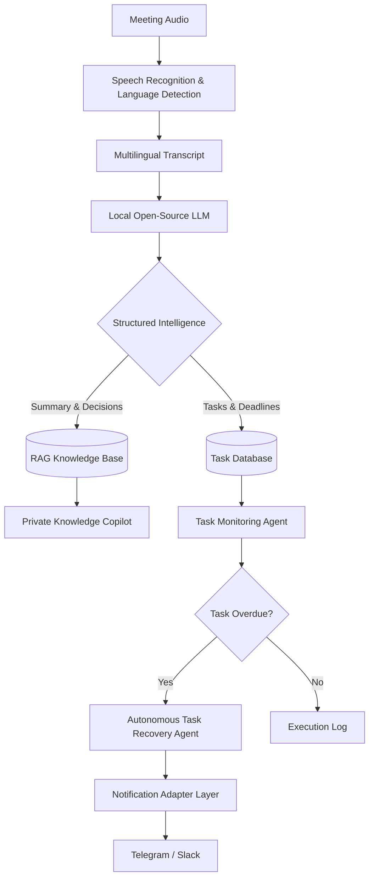
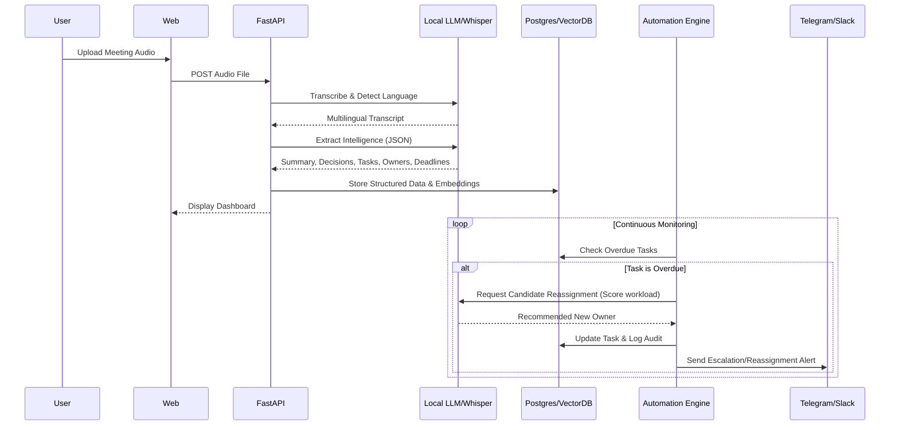
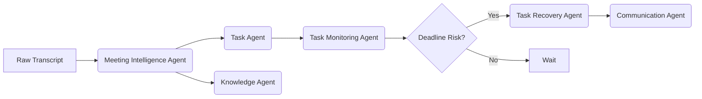
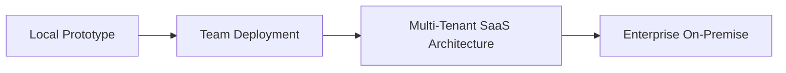

<div align="center">

# MeetMind AI

### From Meetings to Execution

> **A privacy-first, multilingual AI meeting intelligence platform that transforms conversations into knowledge, decisions, tasks, deadlines, and automated execution.**

[](#)
[](#)
[](#)
[](#)
[](#)
[](#)
[](#)
[](#)

</div>

---

## 1. Project Name

**MeetMind AI**

## 2. Problem Statement

Valuable organizational decisions and action items are constantly buried inside long, unstructured meeting recordings. The modern workplace faces critical bottlenecks:

- **Fragmented Execution:** Action items discussed in meetings often lack clear ownership or documented deadlines, leading to missed deliverables.
- **Multilingual Friction:** Global and regional teams frequently communicate in mixed languages (code-switching) or regional dialects, which standard English-centric tools fail to capture accurately.
- **Privacy & Security Risks:** Sending highly sensitive internal meetings (strategy, HR, proprietary research) to external, proprietary AI services introduces significant data exposure and compliance risks.
- **Loss of Institutional Memory:** Once a meeting ends, the context is lost. Teams struggle to query past discussions or retrieve the specific context behind decisions.
- **The Follow-Up Gap:** Existing meeting tools stop at generating a summary. They do not proactively monitor if the extracted tasks are actually completed, nor do they help reassign work when an assignee becomes unavailable.

## 3. Project Overview

MeetMind AI is a **private, automated meeting-to-execution platform**. It ingests meeting audio, understands multilingual conversations, and leverages local, open-source AI to extract structured intelligence—summaries, decisions, tasks, owners, and deadlines. 

Crucially, MeetMind does not stop at summarization. It indexes this information into a secure, Role-Based Access Control (RBAC) governed Knowledge Base, enabling team members to query organizational memory. An integrated Automation Engine continuously monitors task deadlines and, in the event of task risk, utilizes an Autonomous Task Recovery Agent to recommend or execute task reassignment. 



## 4. Proposed Solution

We propose a locally-deployable, agentic AI architecture that processes meetings entirely within an organization's controlled infrastructure. By combining open-weight LLMs, Retrieval-Augmented Generation (RAG), deterministic business logic, and communication integrations, MeetMind provides:
1. **Multilingual Speech Intelligence:** Accurate transcription and semantic understanding across English, Hindi, Marathi, Sindhi, Spanish, and code-switched conversations.
2. **Actionable Information Extraction:** Transforming raw text into structured JSON containing specific action items, assigned owners, and strict deadlines.
3. **Continuous Execution:** An agentic workflow that monitors task state and proactively alerts teams or reassigns tasks to ensure execution happens.

## 5. Objectives

- **Eliminate Manual Meeting Overhead:** Automate note-taking and task assignment without human intervention.
- **Preserve Data Privacy:** Ensure 100% of meeting audio and transcripts can be processed locally without external API calls.
- **Support Multilingual Teams:** Bridge language barriers by understanding diverse languages and dialects naturally used in team settings.
- **Drive Accountability:** Monitor extracted tasks and automatically intervene when deadlines are at risk.
- **Democratize Knowledge:** Provide a secure, RBAC-aware conversational interface for querying past organizational decisions.

## 6. Target Users / Use Case

- **Engineering & Product Teams:** Tracking sprint decisions, API specifications, and bug assignments discussed during daily stand-ups.
- **Research Teams & Academia (Students):** Synthesizing complex research discussions, tracking literature review tasks, and maintaining a localized knowledge base of research progress.
- **Project Managers:** Automating the tedious process of transcribing meetings, creating Jira/Trello tickets, and chasing team members for updates.
- **Small to Medium Enterprises (SMEs):** Organizations needing enterprise-grade meeting intelligence without the enterprise SaaS price tag or data privacy concessions.

## 7. Open-Source AI Technology Selected

| Component | Purpose | Why Open Source? |
|---|---|---|
| **faster-whisper / Whisper** | Speech Recognition | Enables highly accurate, local inference for audio transcription. |
| **Open-weight LLM (e.g., Qwen)** | Reasoning & Extraction | Provides the reasoning engine for summarization and task extraction while maintaining complete data privacy and control. |
| **Embedding Model** | Semantic Retrieval | Allows localized, high-quality semantic search across the knowledge base. |
| **Vector DB (e.g., Qdrant/Chroma)** | RAG Storage | Robust, open-ecosystem storage for document embeddings. |
| **FastAPI** | Backend Orchestration | Fast, asynchronous, lightweight open-source Python backend. |
| **PostgreSQL** | Relational Database | Reliable, ACID-compliant storage for task states and user roles. |
| **React** | Frontend UI | Extensive open-source ecosystem for building interactive dashboards. |

*(Note: Final model selection is subject to optimization during implementation).*

## 8. Why This Technology Was Selected

### The Technical Decision: Why Local AI?

MeetMind is engineered around local/open-source AI because meeting transcripts and organizational knowledge inherently contain highly sensitive information. 

| Approach | Privacy | Control | Cost | Customization |
|---|---|---|---|---|
| Proprietary Hosted AI | Lower control (data leaves infra) | Limited | Usage-based (recurring) | Limited |
| **Local Open AI** | **High control (data stays local)** | **High** | **Infrastructure-based** | **High** |

Local inference mitigates the governance and compliance risks of sending sensitive data to third parties. By utilizing quantized open-weight models and optimized inference engines (like `faster-whisper`), we achieve state-of-the-art performance on consumer or standard server hardware, proving that privacy and AI capability are not mutually exclusive.

## 9. AI's Role in the System

In MeetMind, AI is responsible for cognitive, semantic, and reasoning tasks, while deterministic software handles state and security. 

**AI Responsibilities:**
- Multilingual speech-to-text and language identification.
- Contextual reasoning to distinguish between casual ideas and concrete decisions.
- Extracting tasks, implied/explicit deadlines, and identifying responsible owners based purely on conversation evidence (no hallucination).
- Grounded question answering (RAG) over the authorized knowledge base.
- Task-risk analysis and scoring candidate suitability for reassignment.

**Deterministic System Responsibilities (Safety Principle):**
> *AI recommends and reasons; deterministic systems enforce permissions and business constraints.*
- Authentication and Role-Based Access Control (RBAC).
- Database operations and task state transitions.
- Notification delivery (Telegram/Slack adapters).
- Audit logging.

## 10. System Architecture


## 11. Component-Level Architecture

| Component | Responsibility | Technology |
|---|---|---|
| **Frontend** | User interface & Dashboard | React |
| **Backend** | API gateway, auth, and orchestration | FastAPI |
| **Speech** | Multilingual Transcription | faster-whisper |
| **LLM** | Reasoning, extraction, summarization | Local open/open-weight LLM |
| **RAG** | Knowledge retrieval & grounding | Embeddings + Vector DB |
| **Database** | Structured data (users, tasks, logs) | PostgreSQL |
| **Auth** | Authentication | JWT / Open-source Auth |
| **RBAC** | Authorization & policy enforcement | Backend Policy Layer |
| **Automation** | Task workflows & chron jobs | Python Service / Celery |
| **Prototype Comms**| Messaging for hackathon demo | Telegram Bot API |
| **Production Comms**| Business messaging architecture | Slack Adapter |
| **Deployment** | Local / containerized environment | Docker |

## 12. Data / Information Flow



## 13. Agentic Workflow

MeetMind utilizes a multi-agent architecture to handle specialized tasks:

1. **Meeting Intelligence Agent:** Processes the raw transcript to identify topics, summarize context, and extract macro-level decisions.
2. **Task Agent:** Strictly extracts actionable items, specific owners (only when supported by conversational evidence), and explicit deadlines.
3. **Knowledge Agent:** Manages the RAG pipeline, embedding documents and retrieving context based on user queries and RBAC permissions.
4. **Task Monitoring Agent:** A background process tracking pending tasks against the current timestamp.
5. **Autonomous Task Recovery Agent:** Triggered by the Monitoring Agent; analyzes workload, role compatibility, and availability to reassign at-risk tasks.
6. **Communication Agent:** Formats and routes messages through the appropriate adapter (Slack/Telegram) based on environment.



## 14. Technology Stack

- **Language:** Python 3.10+
- **Frameworks:** FastAPI, React
- **AI/ML:** faster-whisper, HuggingFace Transformers, Ollama (or similar local LLM runner)
- **Databases:** PostgreSQL, Chroma/Qdrant
- **DevOps:** Docker, Docker Compose
- **Integrations:** Telegram Bot API, Slack API

## 15. Expected Features

| Feature | Description |
|---|---|
| **Multilingual Meetings** | Native understanding of English, Hindi, Marathi, Sindhi, Spanish, and code-switching. |
| **Local AI Processing** | 100% local/open-source AI inference for ultimate privacy. |
| **Meeting Summarization** | Highly structured, semantic summaries. |
| **Decision Extraction** | Explicitly isolates and logs important organizational decisions. |
| **Action Item Extraction** | Transforms dialogue into concrete tasks. |
| **Evidence-Based Owner Detection** | Identifies responsible persons *only* when supported by transcript evidence to prevent hallucination. |
| **Deadline Extraction** | Detects explicit temporal commitments. |
| **Private Knowledge Base** | Organization-defined, RAG-powered knowledge store. |
| **RAG Chatbot (Private Copilot)** | Grounded Q&A over authorized knowledge, citing sources. |
| **Role-Based Access Control** | Role-specific access ensuring users only see authorized data. |
| **Task Monitoring** | Continuous tracking of task completion and deadlines. |
| **Autonomous Task Recovery** | Intelligently reassigns incomplete/at-risk tasks based on workload. |
| **Prototype Notifications** | Telegram integration for immediate alerts. |
| **Business Automation**| Slack architecture designed for production deployments. |
| **Audit Trail** | Complete logging of AI decisions and task reassignments. |

## 16. Implementation Approach

The project will be built in progressive phases:

- **Phase 1 — Core Meeting Intelligence:** Audio ingestion, Whisper transcription, language detection, local LLM integration, and structured JSON output.
- **Phase 2 — Task Intelligence:** Task extraction logic, owner/deadline detection, and PostgreSQL schema setup.
- **Phase 3 — Knowledge Intelligence:** Document chunking, embedding generation, Vector DB integration, and the RAG Chatbot.
- **Phase 4 — RBAC:** Authentication implementation, role definitions (Admin, PM, Team Member), and securing knowledge access.
- **Phase 5 — Automation:** Building the Python task engine, Telegram prototype adapter, reminder scheduling, and the Task Recovery Agent.
- **Phase 6 — Business Integration (Architecture):** Designing and stubbing the Slack adapter and workspace integration interfaces.

## 17. Expected Final Output

By the end of the hackathon, the expected output is a fully functional, locally containerized web application where a user can:
1. Upload a multilingual meeting recording.
2. View the generated transcript and structured intelligence (summary, decisions, tasks).
3. Interact with the Private Knowledge Copilot to ask questions about the meeting, restricted by their RBAC role.
4. View the task dashboard.
5. Simulate time passing to trigger the Task Monitoring Agent.
6. Observe the Autonomous Task Recovery Agent reassign an overdue task to an available team member based on deterministic scoring.
7. Receive real-time notification of the reassignment via the Telegram prototype bot.

## 18. Future Scope / Scalability

MeetMind is designed to scale from an individual productivity tool to a multi-tenant enterprise platform.



**Future Capabilities:**
- **Enterprise Integrations:** Deep hooks into Jira, Trello, Asana, and GitHub Issues.
- **Live Meeting Support:** Streaming audio processing via WebSockets for real-time intelligence.
- **Tenant Isolation:** Robust logical separation of data for SaaS deployments.
- **Advanced Workload Analytics:** Predictive burnout analysis based on task assignment volume.

## 19. Open-Source Dependencies / Components

| Component | Purpose | Why Open Source |
|---|---|---|
| **faster-whisper** | Speech recognition | Enables high-speed, local audio inference. |
| **Open-weight LLM** | Reasoning | Guarantees data privacy and architectural control. |
| **Embedding model** | Semantic retrieval | Allows localized knowledge search without external APIs. |
| **Vector DB** | RAG | Thriving open ecosystem and easy local deployment. |
| **FastAPI** | Backend | Extremely fast, lightweight, open-source Python backend. |
| **PostgreSQL** | Database | Industry standard, reliable open-source relational database. |
| **React** | Frontend | Massive open ecosystem and component libraries. |
| **Docker** | Deployment | Ensures cross-platform reproducibility and clean environments. |

*(Note: Exact open-source licenses will be verified and documented prior to final repository submission).*

## 20. Expected Challenges and Mitigation

| Challenge | Proposed Mitigation |
|---|---|
| **Multilingual transcription errors** | Implement language-aware processing, rely on timestamp confidence scores, and utilize robust fallback models. |
| **LLM Hallucination (Fake tasks/owners)** | Enforce strict structured JSON outputs, apply deterministic schema validation, utilize RAG grounding, and mandate evidence-based extraction. |
| **Incorrect autonomous task reassignment**| Implement RBAC checks, workload scoring algorithms, and allow configurable approval policies (e.g., recommend vs. auto-reassign). |
| **Privacy / Data Leakage Risks** | Rely exclusively on local inference, encrypt communication, and enforce authorization *before* knowledge retrieval. |
| **Hardware resource limitations** | Utilize aggressively quantized models (GGUF/AWQ), optimize prompt sizes, and employ a modular microservices architecture. |

---

### Prototype vs. Production Capabilities

To clarify the scope for the hackathon evaluator:

| Capability | Hackathon Prototype | Business / Production Architecture |
|---|---|---|
| **Notifications** | Telegram Bot API | Slack / MS Teams |
| **AI Inference** | Local / Open-source (Consumer GPU/CPU) | Scalable Local / Private Cloud Deployment |
| **Knowledge Base** | Project-specific knowledge base | Multi-tenant, cross-organizational knowledge |
| **Task Recovery** | Prototype automated reassignment | Policy-controlled enterprise automation |
| **RBAC** | Core roles (Admin, Member) | Fine-grained, custom permissions |
| **Deployment** | Local Docker Compose | Kubernetes / Scalable Cloud |

---

### Team
- **Kamal Hariramani**
- **Vikrant**
- **Jayesh**
*(Specific technical roles to be finalized during implementation).*

---

## Vision

> **MeetMind AI aims to turn every meeting from a static conversation into a living source of organizational knowledge, decisions, and execution.**

```text
Understand → Remember → Decide → Assign → Monitor → Recover → Execute
```
